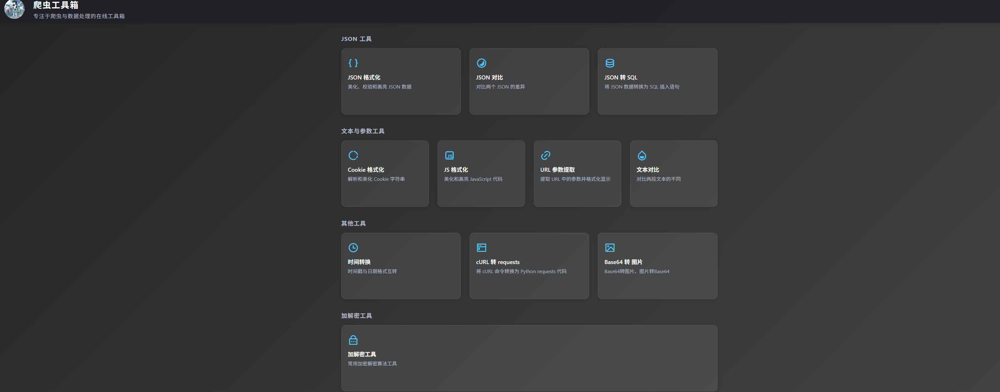
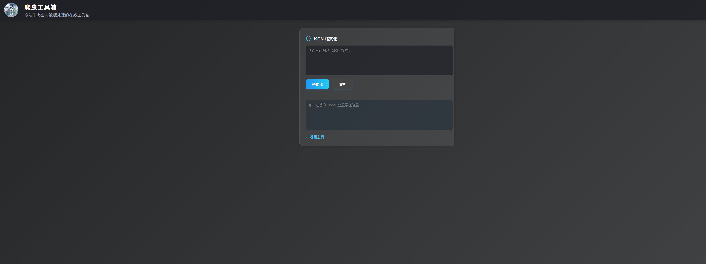

# 爬虫工具箱

一个专注于爬虫与数据处理的在线工具集合，提供多种实用的数据处理和格式化工具。

## 项目内容





项目提供了一系列实用的爬虫开发和数据处理工具，采用深色主题设计，界面简洁美观。

## 功能特点

### JSON 工具

- JSON 格式化：美化、校验和高亮显示 JSON 数据
- JSON 对比：支持对比两个 JSON 的差异
- JSON 转 SQL：将 JSON 数据转换为 SQL 插入语句

### 文本处理工具

- Cookie 格式化：解析和美化 Cookie 字符串
- JS 格式化：美化和高亮 JavaScript 代码
- URL 参数提取：提取 URL 中的参数并格式化显示
- 文本对比：对比两段文本的差异

### 数据转换工具

- cURL 转代码：支持将 cURL 命令转换为 Python/Node.js/Go/Java 代码
- Base64 图片工具：支持 Base64 和图片格式互转
- 时间转换：支持时间戳与日期格式互转

### 加密工具

- 常用加解密算法：支持 MD5、SHA 系列、HMAC 系列、Base64 等

## 技术特点

- 纯前端实现，无需后端服务
- 响应式设计，支持移动端访问
- 优雅的深色主题 UI 设计
- 支持离线使用，所有处理均在本地完成

## 使用方法

1. 直接在浏览器中打开 index.html
2. 选择需要使用的工具
3. 输入数据并点击相应的处理按钮
4. 查看处理结果

## 项目结构

```
.
├── index.html              # 主页
├── json_format.html        # JSON格式化
├── json_compare.html       # JSON对比
├── json_to_sql.html        # JSON转SQL
├── cookie_format.html      # Cookie格式化
├── js_format.html          # JS代码格式化
├── url_param_extract.html  # URL参数提取
├── text_compare.html       # 文本对比
├── curl_to_requests.html   # cURL转代码
├── base64_image.html       # Base64图片转换
├── time_convert.html       # 时间转换
├── encrypt_tools.html      # 加密工具
└── img/                    # 图片资源目录
    └── avatar.jpg         # 网站头像
```

## 浏览器兼容性

- Chrome (推荐)
- Firefox
- Edge
- Safari

## 技术栈

- 网站风格采用现代化的深色主题
- 使用 CSS3 实现渐变背景和毛玻璃效果
- 采用 Remix Icon 图标库
- 响应式设计，适配移动端

## 贡献

欢迎提交 Issue 和 Pull Request 来帮助改进这个项目。
